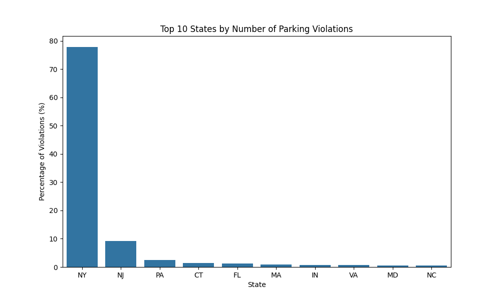
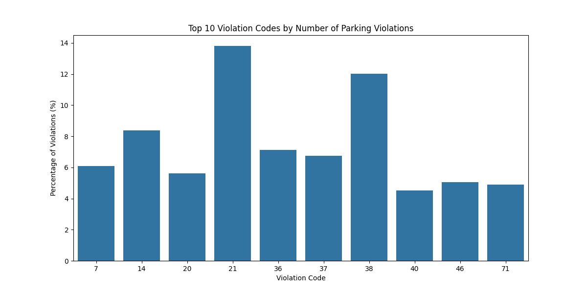
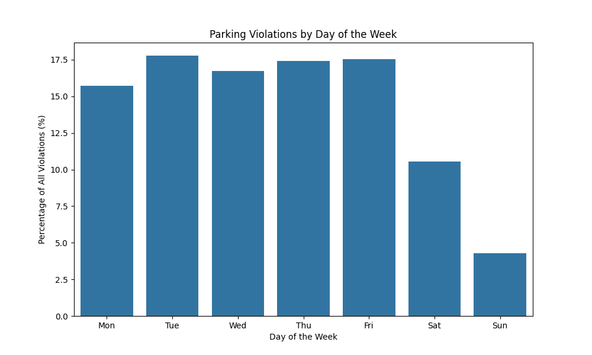
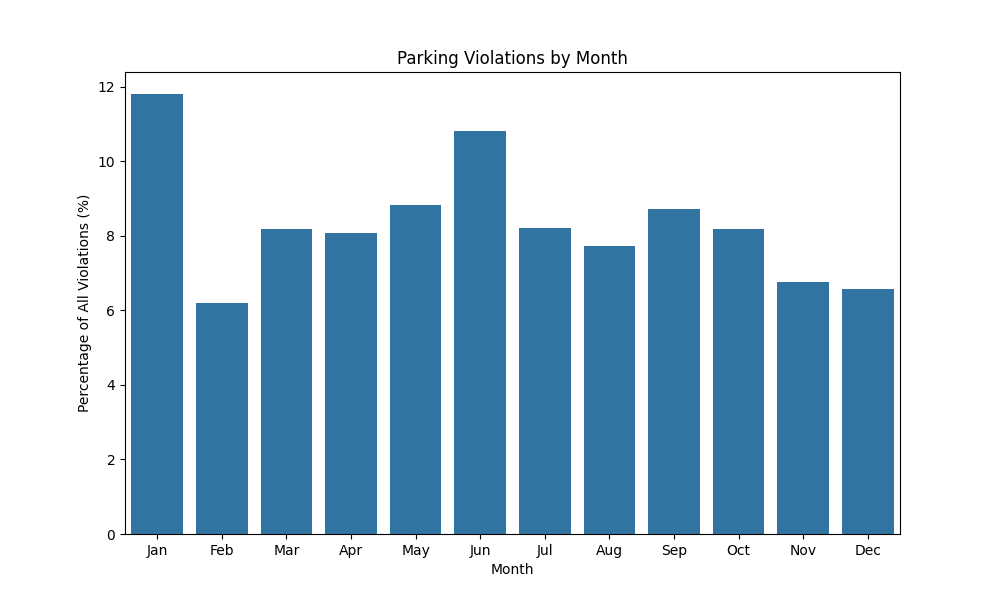
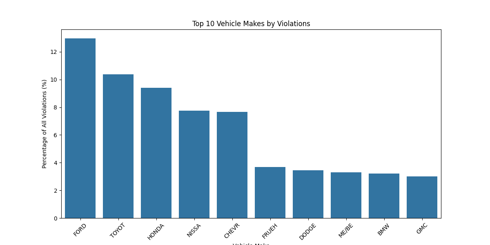
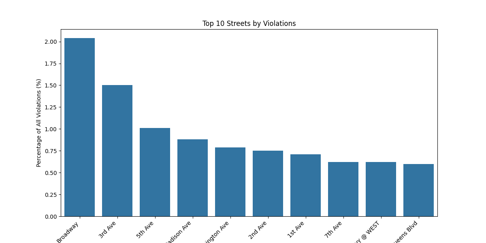
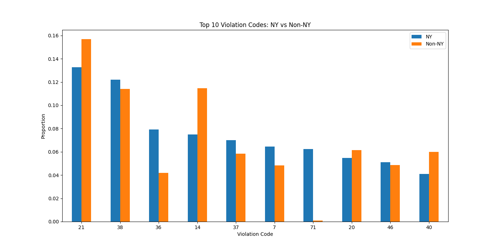

# NYC Parking Violations Analysis - EDA Report

This report summarizes the findings from the Exploratory Data Analysis (EDA) of the NYC Parking Violations dataset for the fiscal year 2015.

## 1. Parking Violations by Registration State

**Insight:**
- **New York (NY)** accounts for the vast majority of violations, approximately **78%**. This is expected as the data is from NYC.
- **New Jersey (NJ)** is the second most common registration state, accounting for about **9%** of violations.
- **Pennsylvania (PA)** follows with around **2.5%**.
- The top 10 states are dominated by nearby states in the Northeast region.

## 2. Top Violation Codes

**Insight:**
- **Violation Code 21 (No Parking - Street Cleaning)** is the most frequent violation, making up about **14%** of all tickets.
- **Violation Code 38 (Fail to Display Muni Meter Receipt)** is the second most common (~12%).
- **Violation Code 14 (No Standing - Day/Time Limits)** is third (~8.4%).
- The top 3 violation codes account for over **34%** of all violations, indicating that a few specific types of infractions drive a large portion of the fines.

## 3. Temporal Patterns

### Day of the Week
**Insight:**
- Violations are significantly higher on weekdays compared to weekends.
- **Thursday and Friday** tend to have slightly higher violation counts.
- **Sunday** has the lowest number of violations, likely due to relaxed parking regulations (e.g., no street cleaning) and lower traffic enforcement activity.

### Month
**Insight:**
- Violation counts fluctuate throughout the year.
- (Refer to the plot below for specific monthly trends observed in the 2015 fiscal year data).

## 4. Vehicle Characteristics

### Top Vehicle Makes
**Insight:**
- **Ford** is the most frequently cited vehicle make (~13%), followed by **Toyota** (~10%) and **Honda** (~9%).
- This likely reflects the popularity of these brands in the NYC area rather than a specific tendency of these drivers to commit violations.

## 5. Location Analysis

### Top Streets
**Insight:**
- **Broadway** has the highest number of violations, which is consistent with it being a major and long thoroughfare in NYC.
- Other major avenues like **3rd Ave**, **5th Ave**, and **Madison Ave** also feature prominently in the top 10.

## 6. NY vs. Non-NY Registered Vehicles

**Insight:**
- There is a significant difference in the types of violations committed by NY registered vehicles versus those from other states.
- **Violation 71 (Inspection Sticker - Expired/Missing)** is highly specific to NY cars (approx. 6.3% of NY violations vs 0.08% for Non-NY). This makes sense as out-of-state vehicles are not subject to NY inspection sticker display laws in the same way.
- **Violation 36 (School Zone Speed Violation)** is more common for NY cars.
- **Violation 14 (No Standing)** is more frequently issued to Non-NY vehicles.
- Statistical testing (Chi-square) confirms a significant association between registration state (NY vs Non-NY) and the type of violation.

## 7. Vehicle Age Analysis

**Insight:**
- Analysis of vehicle age (derived from Ticket Year - Vehicle Year) suggests an association between vehicle age groups (Young, Middle-aged, Old) and violation types.
- (Further detailed breakdown would require looking at the specific contingency tables from the notebook).

## Conclusion

The analysis reveals clear patterns in parking violations in NYC. Enforcement is heavily concentrated on weekdays and specific violation types like street cleaning and meter receipts. There are distinct differences in violation behaviors (or enforcement focus) depending on whether a vehicle is registered in NY or elsewhere, particularly regarding administrative violations like inspection stickers.
